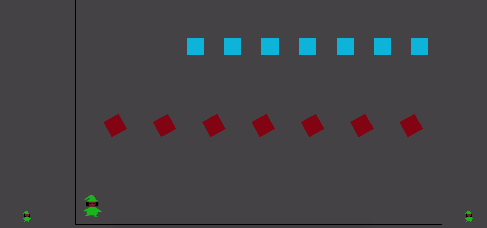

# Project1GA
##Oogie's Labyrinth

 This game is called 'Oogie's Labyrinth'.
 The purpose is ot navigate the mouse through the maze without getting hit, and then pressing the button at the end. 
 There is currently only one level.

 The way you win is to get throuhg the maze without hitting any of the moving enemies. If you hit one, you will be alerted,
 and sent back to the beginning of the game.  

 There is also  a little player on the screen that can be controlled, however it cannot affect, nor be affected by the gameboard.
It might be helpful to use alongside with the cursor. I programmed the board to move up when the player div moves so that it wouldn't be
hidden behind the the overflow: hidden styling.

To make this game I used HTML, CSS, and Javascript  on Sublime Text Editor. To make the more elaborte pieces of art
like the cursor, the moving gifs, and the endgame animation, I used an art app called PiskelApp.

##Code Snippet
>switch (key.which) {
  >        case 37:
  >              //left
  >              if ($('#square').offset().left >= $('#main').offset().left) {
   >                 $('#square').velocity({ left: "-=30px" }, {
    >                    duration: 0,
    >                    easing: 'linear'
    >                })
    >            };
    >            break;

##Build Strategy
To build this game, I thought about a game I would like to play, and scaled down to something I could do.

##Contributing
A lot of people helped me out:
-Tenzin Chhosphel
-Anthony Meija
-Matt Kersner

Thanks guys

##Complications
Here are a few of the complications I've had
-Collision Physics 
I had a lot of divs moving in 20 different directions so it was hard to pinpoint any exact positions.
-Making the gameboard move with the position o the div/cursor.
As it stands the user will either have to scroll up carefully as the play, or use the controllable player dive to move the screen up.

######Future Improvements
    I'd like to learn collision physics, and learn to use the html canvas

